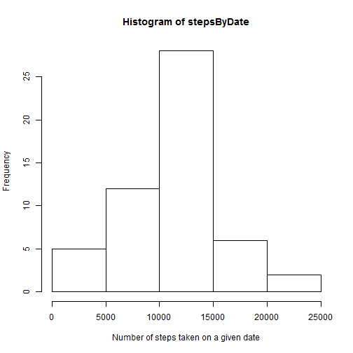
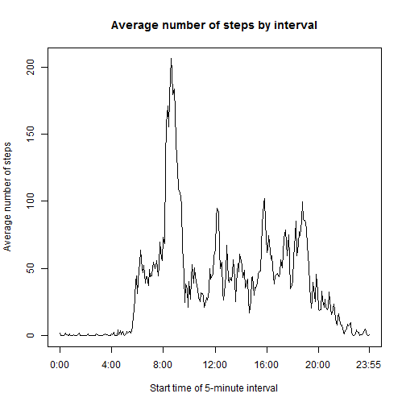
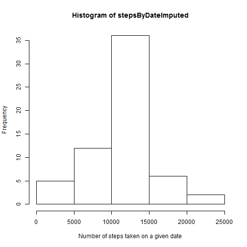
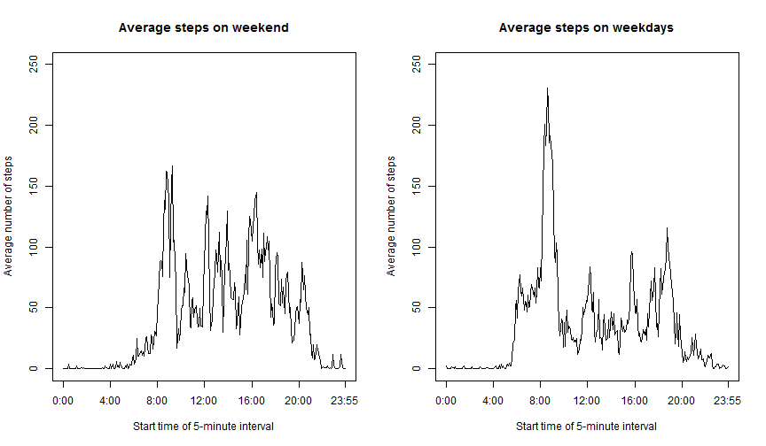

# Reproducible Research: Peer Assessment 1

## Loading and preprocessing the data

We read in the data and convert the date field to R's date format

```r
activity <- read.csv("activity.csv")
activity$date <- as.Date(activity$date)
```

## What is mean total number of steps taken per day?

We make a vector consisting of the number of steps taken on each date (using complete.cases so that the dates on which no data were gathered appear as NA), and make a histogram showing the distribution of the number of steps by date.


```r
stepsByDate <- tapply(activity$steps, activity$date, sum, complete.cases=TRUE)
hist(stepsByDate, xlab = "Number of steps taken on a given date")
```

 

Mean number of steps per day:

```r
mean(stepsByDate, na.rm = TRUE)
```

```
## [1] 10767
```

Median number of steps per day:

```r
median(stepsByDate, na.rm = TRUE)
```

```
## [1] 10766
```

## What is the average daily activity pattern?

We make a vector consisting of the average number of steps taken, across all days, during each of the 288 five-minute time intervals, and plot this average against the starting time of the interval.

```r
meanStepsByInterval <- tapply(activity$steps, activity$interval, mean, na.rm = TRUE)
plot(1:288,meanStepsByInterval,type = "l", xaxt="n", xlab = "Start time of 5-minute interval", ylab = "Average number of steps", main = "Average number of steps by interval")
axis(1,at=c(seq(1,241,by=48),288),labels=c("0:00","4:00","8:00","12:00","16:00","20:00","23:55"))
```

 

We find the time interval during which, on average, the most steps were taken.

```r
names(meanStepsByInterval)[which.max(meanStepsByInterval)]
```

```
## [1] "835"
```
Thus the maximum average number of steps was observed in the five-minute time interval beginning at 8:35 am.

## Imputing missing values

Number of missing values:

```r
sum(is.na(activity))
```

```
## [1] 2304
```

Note that 2304 = 288x8; the only missing values in the data correspond to 8 dates for which *all* 288 time intervals are missing.

We make a new data frame, "activityImputed", in which we replace all missing values in the original data frame "activity" by the mean number of steps for the corresponding time interval.

```r
activityImputed <- activity
for (i in 1:nrow(activityImputed)) {
     if(is.na(activityImputed[i,1])) 
         activityImputed[i,1] = meanStepsByInterval[as.character(activity[i,3])]  
     }
```

We now repeat the first part of the analysis but now with the imputed values, making a histogram of the number of steps by date and then computing the mean and median:

```r
stepsByDateImputed <- tapply(activityImputed$steps, activityImputed$date, sum, complete.cases=TRUE)
hist(stepsByDateImputed, xlab = "Number of steps taken on a given date")
```

 

```r
mean(stepsByDateImputed, na.rm = TRUE)
```

```
## [1] 10767
```

```r
median(stepsByDateImputed, na.rm = TRUE)
```

```
## [1] 10767
```

Imputing missing values in this way does not meaningfully affect the mean and median; the only change in the histogram is that the 8 dates for which all values were originally missing have been assigned data which puts them precisely in the middle of the distribution, thus increasing the height of the middle column by 8.

## Are there differences in activity patterns between weekdays and weekends?

We now add a column to activityImputed indicating whether or not the day falls on the weekend, and we compute separate vectors consisting of the mean number of steps for each time interval on the weekend and on weekdays.


```r
activityImputed$weekend <- weekdays(activityImputed$date) %in% c("Sunday","Saturday")
meanWeekendStepsByInterval <- tapply(activityImputed[activityImputed$weekend == TRUE,"steps"],activityImputed[activityImputed$weekend == TRUE,"interval"],mean)
meanWeekdayStepsByInterval <- tapply(activityImputed[activityImputed$weekend == FALSE,"steps"],activityImputed[activityImputed$weekend == FALSE,"interval"],mean)
```

Finally, here is a panel plot of the average number of steps during each time interval on weekend days and on weekdays.

```r
par(mfrow=c(1,2))
plot(1:288,meanWeekendStepsByInterval,type="l", xaxt="n",ylim = c(0,250), xlab = "Start time of 5-minute interval", ylab = "Average number of steps", main="Average steps on weekend")
axis(1,at=c(seq(1,241,by=48),288),labels=c("0:00","4:00","8:00","12:00","16:00","20:00","23:55"))
plot(1:288,meanWeekdayStepsByInterval,type="l", xaxt="n",ylim = c(0,250), xlab = "Start time of 5-minute interval", ylab = "Average number of steps", main="Average steps on weekdays")
axis(1,at=c(seq(1,241,by=48),288),labels=c("0:00","4:00","8:00","12:00","16:00","20:00","23:55"))
```

 
